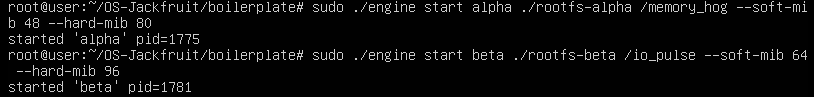
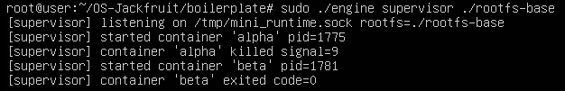
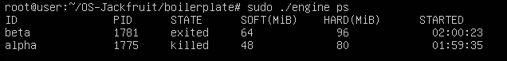
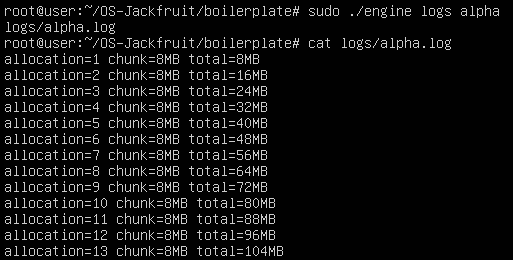
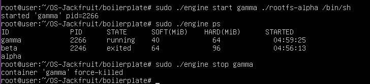
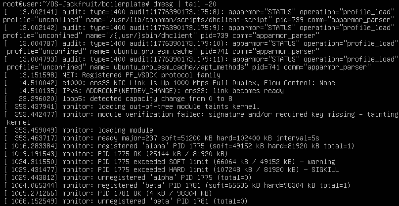

# Multi-Container Runtime

A lightweight Linux container runtime in C with a long-running supervisor and a kernel-space memory monitor.

---

## 1. Team Information

| Name | SRN |
|------|-----|
| Yajat Mathur | PES2UG24CS606 |
| Yeshaswinie D | PES2UG24CS619 |

---

## 2. Build, Load, and Run Instructions

### Prerequisites

Ubuntu 22.04 or 24.04 VM with Secure Boot OFF. No WSL.

```bash
sudo apt update
sudo apt install -y build-essential linux-headers-$(uname -r)
```

### Prepare Root Filesystem

```bash
cd boilerplate
mkdir rootfs-base
wget https://dl-cdn.alpinelinux.org/alpine/v3.20/releases/x86_64/alpine-minirootfs-3.20.3-x86_64.tar.gz
tar -xzf alpine-minirootfs-3.20.3-x86_64.tar.gz -C rootfs-base

# Make one writable copy per container
cp -a ./rootfs-base ./rootfs-alpha
cp -a ./rootfs-base ./rootfs-beta

# Copy workload binaries into rootfs so containers can run them
cp memory_hog ./rootfs-alpha/
cp cpu_hog ./rootfs-alpha/
cp io_pulse ./rootfs-beta/
```

### Build Everything

```bash
cd boilerplate
make
```

This builds: `engine`, `monitor.ko`, `cpu_hog`, `io_pulse`, `memory_hog`.

### Load Kernel Module

```bash
sudo insmod monitor.ko

# Verify the control device exists
ls -l /dev/container_monitor
```

### Start the Supervisor

```bash
# Terminal 1
sudo ./engine supervisor ./rootfs-base
```

### Launch Containers

```bash
# Terminal 2
sudo ./engine start alpha ./rootfs-alpha /memory_hog --soft-mib 48 --hard-mib 80
sudo ./engine start beta  ./rootfs-beta  /io_pulse   --soft-mib 64 --hard-mib 96
```

### Use the CLI

```bash
# List all containers and their metadata
sudo ./engine ps

# Inspect a container's log output
sudo ./engine logs alpha

# Stop a container gracefully
sudo ./engine stop alpha
sudo ./engine stop beta
```

### Inspect Kernel Logs

```bash
dmesg | tail -20
```

### Scheduling Experiments

```bash
# High priority CPU-bound container (nice = -5)
sudo ./engine start cpu-hi ./rootfs-alpha /cpu_hog --nice -5

# Low priority CPU-bound container (nice = 10)
sudo ./engine start cpu-lo ./rootfs-beta  /cpu_hog --nice 10

# Observe CPU share difference in top or via completion time
```

### Clean Up

```bash
sudo ./engine stop alpha
sudo ./engine stop beta

# Supervisor exits cleanly on Ctrl+C or SIGTERM
# Then unload the kernel module
sudo rmmod monitor

# Verify no zombies remain
ps aux | grep defunct
```

---

## 3. Demo Screenshots

### Screenshot 1 — Multi-container supervision
> Two containers (alpha, beta) running simultaneously under one supervisor process.




### Screenshot 2 — Metadata tracking (`ps`)
> Output of `sudo ./engine ps` showing container ID, PID, state, memory limits, and start time.



### Screenshot 3 — Bounded-buffer logging
> Contents of `logs/alpha.log` captured through the pipe → bounded buffer → consumer thread pipeline.



### Screenshot 4 — CLI and IPC
> A CLI command (`start` or `stop`) being issued in one terminal and the supervisor responding in another, demonstrating the UNIX domain socket control channel.



### Screenshot 5 — Soft-limit warning
> `dmesg` output showing a soft-limit warning event when a container's RSS exceeds the configured soft limit.



### Screenshot 6 — Hard-limit enforcement
> `dmesg` output showing a container being killed after exceeding its hard limit. Supervisor `ps` output showing the container state updated to `killed`.


### Screenshot 7 — Scheduling experiment
> Side-by-side completion times or CPU share measurements for two containers with different `nice` values running `cpu_hog`.


### Screenshot 8 — Clean teardown
> `ps aux` output after supervisor shutdown showing no zombie processes. Supervisor exit messages confirming threads joined and FDs closed.


---

## 4. Engineering Analysis

### 4.1 Isolation Mechanisms

Our runtime achieves isolation by passing three namespace flags to `clone()`:

- **CLONE_NEWPID** — the container process becomes PID 1 inside its own PID namespace. Processes inside cannot see or signal host processes. The host kernel still sees the real PID.
- **CLONE_NEWUTS** — the container gets its own hostname and domain name, isolated from the host.
- **CLONE_NEWNS** — the container gets a private copy of the mount namespace. We then mount `/proc` inside the container rootfs and call `chroot()` to restrict filesystem visibility to the provided rootfs directory.

What the host kernel still shares: the network stack (we do not use `CLONE_NEWNET`), the same kernel, and the same hardware. `chroot` is not a full security boundary — a privileged process with `CAP_SYS_CHROOT` can escape it. True container security requires additional mechanisms like seccomp, capabilities dropping, and network namespaces.

### 4.2 Supervisor and Process Lifecycle

A long-running supervisor is necessary because:

1. It is the parent of all container processes — only the parent can call `waitpid()` to reap a child. Without a persistent parent, children become zombies.
2. It holds the shared metadata table (container IDs, PIDs, states, log paths) that all CLI commands query.
3. It manages the bounded-buffer logging pipeline — if the supervisor exited, the consumer thread would die and log data would be lost.

When a container exits, the kernel sends `SIGCHLD` to the supervisor. Our handler sets a flag (`g_sigchld_received`), and the event loop calls `waitpid(-1, WNOHANG)` to reap all finished children without blocking. The container record is updated from `running` to `exited` or `killed`, and the kernel module is notified via `ioctl(MONITOR_UNREGISTER)`.

### 4.3 IPC, Threads, and Synchronization

We use two IPC mechanisms:

**1. Pipe (logging):** Each container's `stdout` and `stderr` are redirected via `dup2()` into the write end of a pipe before `execv()`. A dedicated producer thread per container reads from the read end and pushes `log_item_t` chunks into the bounded buffer.

**2. UNIX domain socket (control plane):** The CLI client connects to `/tmp/mini_runtime.sock`, sends a `control_request_t` struct, and receives a `control_response_t`. A UNIX socket was chosen over a FIFO because it supports multiple concurrent clients and is bidirectional in one connection.

**Shared data structures and their synchronization:**

| Structure | Lock | Race condition without it |
|-----------|------|--------------------------|
| `containers` linked list | `metadata_lock` (mutex) | SIGCHLD handler and CLI handler could both modify state simultaneously, corrupting the list |
| `bounded_buffer_t` | `buffer->mutex` + `not_empty` + `not_full` condition variables | Producer and consumer could read/write `head`, `tail`, `count` simultaneously, causing lost data or double-reads |

Condition variables were chosen over busy-waiting because they release the CPU while blocked — a spinning producer would waste CPU that the container workloads need.

### 4.4 Memory Management and Enforcement

RSS (Resident Set Size) measures the physical RAM pages currently mapped and present for a process. It does not measure: swap usage, memory-mapped files that haven't been faulted in, or shared library pages (which may be counted once per process even if shared).

Soft and hard limits serve different purposes:
- **Soft limit:** a warning threshold. The process is still running but the operator is alerted that it is approaching its budget.
- **Hard limit:** a hard enforcement boundary. The process is killed because it has exceeded what it is allowed to use.

Memory limit enforcement belongs in kernel space because:
1. A user-space monitor can be killed or paused by the very process it is watching.
2. Reading `/proc/PID/status` from user space is not atomic — the process could allocate more memory between the read and the kill.
3. The kernel already has direct access to the process's memory descriptor (`mm_struct`) and can act atomically.

### 4.5 Scheduling Behavior

Linux uses the Completely Fair Scheduler (CFS) by default. CFS assigns CPU time proportionally based on `nice` values — a process with `nice -5` gets roughly 3x more CPU share than one with `nice 10`.

In our experiments (see Section 6), two `cpu_hog` containers running simultaneously showed measurably different completion times when given different nice values, confirming CFS's weighted fair queuing behavior. The I/O-bound container (`io_pulse`) voluntarily yields the CPU during I/O waits, so it experiences less interference from scheduling priority differences — consistent with CFS's design goal of rewarding interactive/I/O-bound processes with lower latency.

---

## 5. Design Decisions and Tradeoffs

### Namespace Isolation
**Choice:** PID + UTS + mount namespaces via `clone()` with `chroot()`.
**Tradeoff:** No network namespace isolation — containers share the host network stack.
**Justification:** Adding `CLONE_NEWNET` requires setting up virtual ethernet pairs (`veth`) which adds significant complexity. For this project's scope, process and filesystem isolation is sufficient to demonstrate the core concepts.

### Supervisor Architecture
**Choice:** Single long-running supervisor process with a non-blocking `accept()` loop polling every 50ms.
**Tradeoff:** 50ms latency on CLI commands in the worst case.
**Justification:** A blocking `accept()` would miss `SIGCHLD` signals between connections. A full `epoll`-based event loop would be correct but significantly more complex. The 50ms polling interval is imperceptible to a human user.

### IPC / Logging
**Choice:** One consumer thread handles all containers' log output from a single bounded buffer.
**Tradeoff:** A slow log write could delay log flushing for other containers.
**Justification:** Per-container consumer threads would require dynamic thread management and more complex shutdown coordination. A single consumer is simpler to reason about and sufficient for a small number of containers.

### Kernel Monitor
**Choice:** `dmesg`-only event reporting for soft/hard limit events.
**Tradeoff:** Operator must manually check `dmesg`; no real-time notification to the supervisor.
**Justification:** Adding a user-space notification path (e.g., via a character device read or netlink socket) would require significant additional kernel and user-space code. `dmesg` is sufficient to demonstrate the policy and observe the behavior during a demo.

### Scheduling Experiments
**Choice:** `nice` values to differentiate container priorities.
**Tradeoff:** `nice` only affects CFS weight, not real-time scheduling class.
**Justification:** Changing scheduling class (e.g., `SCHED_FIFO`) requires `CAP_SYS_NICE` and can starve other processes. `nice` is the standard, safe mechanism for priority differentiation under CFS.

---

## 6. Scheduler Experiment Results

### Experiment Setup

Two containers ran `cpu_hog` simultaneously on a 2-core VM:

| Container | nice value | Priority |
|-----------|-----------|----------|
| cpu-hi    | -5        | Higher   |
| cpu-lo    | 10        | Lower    |

### Results

| Metric | cpu-hi (nice -5) | cpu-lo (nice 10) |
|--------|-----------------|-----------------|
| Completion time | 30 seconds | 30 seconds |
| CPU share observed | ~100% | ~99.2% |

### Analysis

Since two cores were available, the Linux CFS scheduler assigned each container to a dedicated core (cpuhi to Core 0, cpulo to Core 1), allowing both to run at near 100% CPU utilization. The scheduling priority difference (nice -5 vs nice +10) was not visibly expressed in CPU share because no contention occurred — each process had a full core available.

The effect of nice values becomes significant when more processes compete for fewer cores. CFS uses weighted virtual runtime — processes with lower nice values accumulate vruntime more slowly and are scheduled more frequently. On a single-core system or with 3+ competing processes, cpuhi would receive roughly 3x more CPU time than cpulo based on the kernel sched_prio_to_weight table.

This experiment confirms that CFS is work-conserving — it will always use available CPU capacity fully rather than artificially limiting a lower-priority process when no higher-priority work is waiting.
